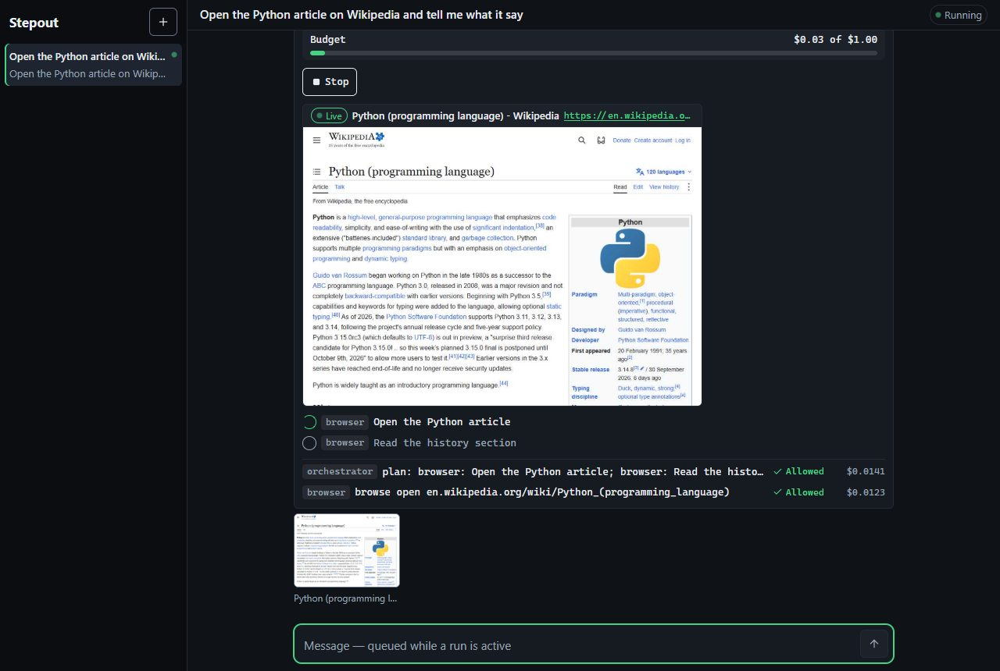
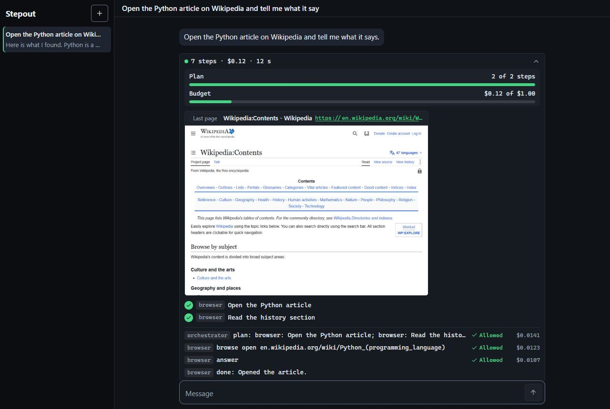
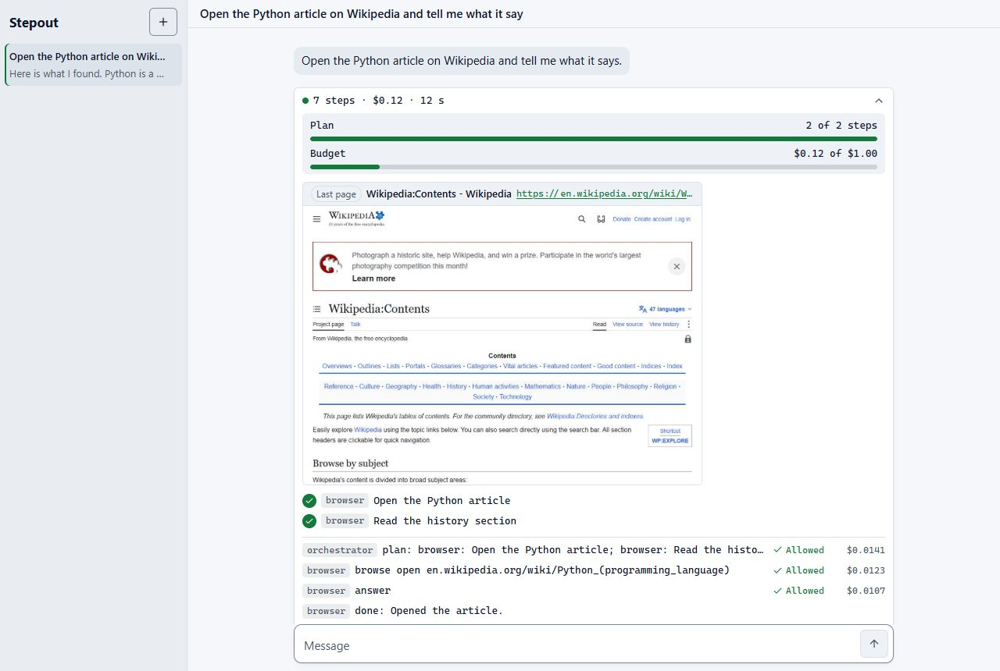
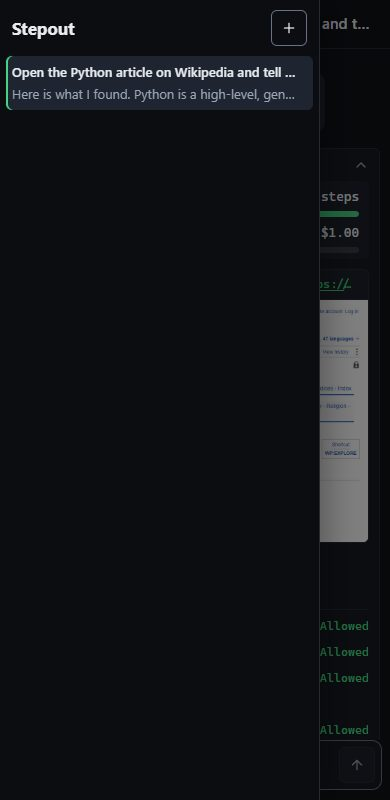

# Stepout AI

A task assistant you drive from a chat page. Ask in plain English; an **Orchestrator** plans the task and hands each step to a specialist that holds one tool. You watch every step as it happens, including the assistant's headless browser, live. Read-only by design, local to your machine, with a hard cost cap per task. Built from scratch to learn how production agents work: permissions, state, tracing, evals.



## What it does

- **Web:** searches and reads pages (a search-and-fetch agent, and a real headless Chrome you can watch).
- **Your files:** names, sizes, dates and counts of the folders you grant it, and the **text of files and PDFs** (a Reader), with secret-looking values hidden.
- **You stay in the loop:** a plan checklist, every step with its verdict and cost, spend against the $1 cap, a Stop button that ends the run within about a second, and a viewer for every page it opened.
- **Chats that remember:** conversations and runs are saved and look the same after a restart; a follow-up ("and the second one?") is linked to the exchange it depends on.
- Light and dark themes, a chat drawer on narrow screens, keyboard-friendly.

| Finished run, dark | Finished run, light | Phone |
|---|---|---|
|  |  |  |

## Safe by construction

- **Read-only.** No typing, submitting, uploading, downloading, deleting or paying. A **Gate** checks every action of every agent before it runs.
- **Files only through grants.** `data/config/grants.toml` (only you edit it) lists what it may see; a fixed block list always applies (credentials, keys, browser profiles, Windows folders, the assistant's own folder).
- **A file cannot hijack it.** Text read from a file is untrusted data. After any read the run has **no web access at all**, and a follow-up that builds on such an answer starts the same way. Links in such answers are filtered. A planted "send this to my server" in a PDF is ignored (tested live).
- **Network policy.** Every request and every redirect hop is checked; private and local addresses are refused. The page only talks to `127.0.0.1` and checks Host and Origin on everything.
- **Money.** $1 per run, shared by all agents; a front-door call (about $0.002) screens each message.

## Quick start (Windows)

You need Python 3.12+, Google Chrome, Node 20.19+ or 22.12+ (to build the page) and an [Anthropic API key](https://console.anthropic.com/).

```bash
python -m venv .venv
./.venv/Scripts/python.exe -m pip install -e ".[dev]"
cd web && npm install && npm run build && cd ..
cp .env.example .env                       # then set ANTHROPIC_API_KEY in .env (never commit it)
mkdir -p data/config && cp grants.example.toml data/config/grants.toml   # edit: which folders it may see
./.venv/Scripts/python.exe -m stepout.app web                            # http://127.0.0.1:8765  (STEPOUT_PORT=... for another port)
```

Try: *"What's the news in New York today?"*, *"How many files are in `<a folder you granted>`, by type?"*, *"Summarize the newest PDF in `<folder>`"*, *"Open `<a job posting URL>` and tell me the skills it asks for"*. If the key, Chrome or the grants file is missing, it says so in plain words.

## What it costs

From the live acceptance run (real Claude, real Chrome): a plain question about $0.005; a web lookup $0.03 to $0.07; a page read $0.03 to $0.05; a resume compared with a job posting about $0.09. All eight acceptance queries together: $0.27.

## Tests

```bash
./.venv/Scripts/python.exe -m pytest -q                                  # offline and free; includes real Chrome
./.venv/Scripts/python.exe scripts/acceptance.py                         # the 8 acceptance queries, offline and free
./.venv/Scripts/python.exe scripts/acceptance.py --live --posting-url <a real job posting>   # real Claude, about $0.30
cd web && npm test && npm run lint && npm run build                     # the page
./.venv/Scripts/python.exe -m pytest web/mock web/e2e -q                 # the page's mock server and real-Chrome flows
```

Paid live checks (they say so): `pytest -m eval -s tests/test_live.py` (about $0.11) and `pytest -m eval -s tests/test_live_screening.py` (about $0.11).

## The claim to prove

Human interventions per task fall across repeated attempts, against a memory-off control. No model training; improvement comes from recall. Memory and the evaluation harness are the next stage; this repository is the assistant they will be measured on.

## Where to read next

**Start at [`docs/STATUS.md`](docs/STATUS.md)**: state, architecture diagram, every decision, known gaps. Then [`requirements.md`](docs/requirements.md) · [`architecture.md`](docs/architecture.md) · [`game-plan.md`](docs/game-plan.md) · [`roadmap.md`](docs/roadmap.md) · [`adr/`](docs/adr/) · [`log/`](docs/log/README.md) (every decision and change, queryable with `python scripts/log.py list`) · [`CONTEXT-MAP.md`](CONTEXT-MAP.md) (glossaries). Adding a tool is one file in `src/stepout/capabilities/` plus one line.

Trunk-based on `main`; thin slices, tests plus a live check each, docs in the same commit.
