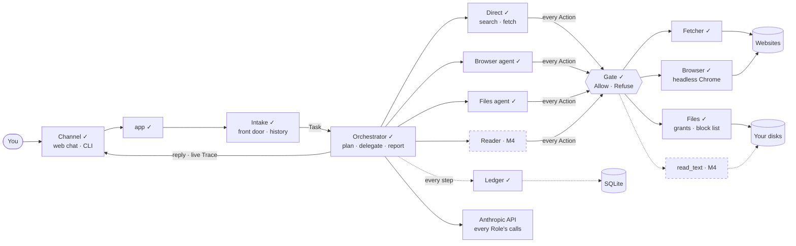

# Stepout AI — status and handoff (read this first)

Updated 2026-10-07 · after milestone M3 · `main` is the only branch.

**What it is.** A task agent you drive from a chat page (Telegram later). An **Orchestrator** plans each request and hands steps to specialist agents that each hold one hand: web search, a headless browser, the disk's file names. It reports back while you watch every step live. **Claim to prove (later):** human interventions per task fall across repeated attempts versus a memory-off control; no model training, recall only ([ADR 0004](adr/0004-drop-zero-model-replay.md)).

## Where we are

| Milestone | Built and verified | Result |
|---|---|---|
| **S1** domain core | Intake, Gate, Runner, Fetcher, Ledger/Store, CLI | live: decline $0, "2+3" $0.02, NYC news $0.26 (single loop) |
| **web chat** | Vite + React page, aiohttp WebSocket channel (localhost, origin-checked) | works; found and fixed a `tools=null` API bug |
| **M1** Orchestrator | one loop, Role table, Plan, shared $1 Budget, Stop, live Trace, source links | NYC news $0.068 (4× cheaper); Stop works |
| **M2** Files | `list`/`find`/`count`, real-path resolution, fixed block list, `grants.toml`, 60 s walks | real D: drive: 1.6M files counted, PARTIAL; `.env` refused; "find my resume" asks for a hint, then finds it ($0.034) |
| **M3** Browser | headless installed Chrome, read-only, every request and redirect hop policed, screenshots in the trace | zero requests reach a private server by any route; live smoke suite 6/6 |

**Tests:** 132 offline (`pytest -q`, includes real Chrome) + 6 live smoke tasks (`pytest -m eval`, about $0.11). **Next: M4 (Reader)**, then S3 Approvals.

## Run, test, verify
```bash
./.venv/Scripts/python.exe -m pytest -q                                        # offline, scripted model
./.venv/Scripts/python.exe -X utf8 -m pytest -m eval -s tests/test_live.py     # real API + Chrome + disk, prints calls and $ per task
./.venv/Scripts/python.exe -m stepout.app web                                  # chat at http://127.0.0.1:8765 (or no arg: terminal)
cd web && npm install && npm run build                                         # after editing the page
```
Setup: `.env` with `ANTHROPIC_API_KEY` (never read or print it); `data/config/grants.toml` from `grants.example.toml` (only the User edits it). Gitignored: `.env`, `data/`, `.archify/`, `graphify-out/`, `.claude/settings.local.json`. Restart the server after changing Python.

## How it fits together

✓ built · dashed = planned. Design-level detail: [`architecture.md`](architecture.md) (target design; this file is the reality).

| Code | Job |
|---|---|
| `capabilities/` | **one file per tool** (`fetch` `files` `browse` `web_search`): tool schema, Action, executor, Gate rule, Trace line, repeat guard, note trimming, blurb. `__init__.py` holds `ALL`: **a new capability is one new file plus one line there** |
| `runner.py` | the one agent loop for every Role; shared Budget/Gate/Ledger; plan auto-starts its first step; Stop; runs any capability through the registry |
| `roles.py` | Role table: prompt, tools (capability names), model, step cap (Orchestrator Sonnet 5, Direct Haiku 4.5, Files Haiku 4.5, Browser Sonnet 5); the plan's role list comes from it |
| `model.py` | Anthropic adapter; control tools `plan delegate answer`, every other tool from the registry; citations → Sources list |
| `gate.py` | `check(action, role's kinds)`, then the capability's own rule |
| `files.py` / `browser.py` / `fetch.py` | the hands; each enforces its own path or network policy (a capability reaches its hand through `RunContext.hands`) |
| `intake.py`, `screening.py` | `/commands`, then the front door: one cheap call that declines, answers chat, or passes on the Exchanges a message depends on (fails open to the last 3) |
| `ledger.py`, `store.py`, `domain.py` | append-only events (role, parent, chat), tasks/runs/chats rows, SQLite with tracked migrations, plain-data types |
| `contract.py`, `history.py` | the page↔backend wire types (`docs/ui-contract.md` v1) and the read-only reader that returns them from the database |
| `channels/web.py`, `channels/cli.py`, `app.py`, `web/` | channels (trace out, Stop in, screenshot route), wiring, the React page |

## Decisions (and where to read more)

| Decision | Why | Where |
|---|---|---|
| Build the parts we measure; borrow plumbing (Playwright, Anthropic SDK, Pydantic, aiohttp); no agent framework | learn how agents work | ADR 0001 |
| V0 = one Python process on the laptop; no Docker/cloud/credentials/email | scope | ADR 0002 |
| Memory = plain files first; mem0 later as a measured challenger | measurable | ADR 0003 |
| Zero-model replay dropped; headline metric is interventions per task | honest claim | ADR 0004 |
| Two contexts: Assistant and Evaluation (evaluation never grades itself) | trust | ADR 0005 |
| SQLite; one `Store`; migrations tracked by `PRAGMA user_version` | simple, Postgres later | ADR 0006 |
| Actions/Results are plain serializable data | hands can move off-laptop in V1 | ADR 0007 |
| Laptop files only through Grants + fixed block list | safety | ADR 0008 |
| The web page is React (Vite + TS) served by the Python process | not thrown away | ADR 0009 |
| **One loop, five Roles**; Orchestrator plans as data (no separate Planner); only it talks to the User; Findings are untrusted; one Gate/Budget/Taint/Ledger per Run | context isolation, least privilege, one agent in charge of the log | ADR 0010 |
| V0-basic is **read-only**: no typing, submitting, uploading, downloading, deleting | no Approvals yet | ADR 0010 |
| $1 per Run shared by all Roles, at most 3 web searches | cost control | ADR 0010 |
| Headless fresh Chrome via the installed Chrome; never the User's everyday Chrome | their logins stay out of reach | ADR 0010 |
| Whole C: and D: granted in read mode, minus the block list (`.ssh`, `.env`, keys, browser profiles, Windows credentials, Windows, Program Files, the Assistant's own folder) | the User's call; secrets stay out | `grants.toml`, `files.py` |
| **No full-drive scans:** `find` refuses a drive root; counts stop at 60 s and say PARTIAL; when unsure the agent asks which folder | the User's call; smarter search later | `files.py`, game-plan "Later" |
| After a file's contents are read, web access is limited to sites the User named (M4) | exfiltration through URLs | ADR 0010, FR45 |
| Computer use is out of V0 | the Gate can't judge pixel clicks | ADR 0010 |
| API facts: no forced `tool_choice` (newer models reject it); basic `web_search_20250305` (the 2026 versions need code execution, Haiku can't); `max_uses` = searches left | read from the official docs | `model.py` |
| Orchestration efficiency: a plan starts its first step; every Role's state ends "results are above, answer if enough"; repeated identical hand actions are not re-run; only a Role's newest two page views stay in its notes | 1–4 calls per simple task | `runner.py` |
| Browser safety: `route.fetch(max_redirects=0)`, redirect hops checked by us, page WebSockets and media blocked, DNS verdict per host:port | Playwright follows redirects itself | `browser.py` |
| Trace = the Ledger's events streamed live; Stop = a flag checked between steps and inside walks | visibility | `runner.py`, `channels/` |
| Process: thin vertical slices, tests + a live check each, docs in the same commit, third-party skills only if used (`docs/third-party.md`), public repo: no secrets or personal paths in git | | `CLAUDE.md` |

## Remaining, in order
> **Replanned 2026-10-07:** the order of work is now [`plan/README.md`](plan/README.md) (two lanes, iterations B1–B6 and U1–U6). The Reader below is iteration B4; Approvals and pause/resume are B5. The list below is the older view; each lane's progress is in its section further down.

1. **M4 Reader** — `read_text` for text and PDF (pypdf; check its licence), secret screening, 20 reads/10 MB/40k chars per Run, Taint, and the "no web after a read" rule; demos: summarize the newest PDF; compare my resume to a job posting.
2. **S3 Approvals + pause/resume** — Questions, Approvals, Checkpoints, `recover()`: needed for uploads and form filling, and so a hint like "it's in the 2026 resume folder" continues the same task (today it arrives as a new request with no memory).
3. S4 Telegram · S5 Memory (recall, Persona, Notes) · S6/S7 Evaluation and the security suite (one loop vs orchestrated is a Condition) · S9 persona editor · S10 mem0 · S11 organize files. See [`roadmap.md`](roadmap.md).
4. Ideas parked: smarter file search (ask with options, rank folders, prune `node_modules`/`.git`/venvs, fuzzy names), a Verifier before replying, a separate Planner and parallel steps (V1).

**Open questions:** secret screening method (patterns vs model) · PDF library licence · is a click Consequential (S3) · evaluation matrix vs the $25/month budget (S6).

## Known gaps (ceilings, not bugs)
Stop takes effect at the next step (up to ~20 s inside a long search) · a search ending in `pause_turn` is returned partial · a malformed tool call shows "Something went wrong" instead of being fed back · chat/trace history lives in memory until restart · the Orchestrator sometimes over-plans · whole-drive counts are partial by design · names and paths from `list`/`find` go to the model API (counts don't) · a folder swapped for a link between resolve and walk isn't caught (walks never follow links) · screenshots in `data/runs/` are never cleaned up · subresource redirects are dropped, not followed.

## Gotchas for the next agent
Windows-only paths (`files.py`). Run tests with the venv Python. In generated Python, write Windows paths with `\\` (a bare `\D` is a `SyntaxWarning`; CI-style check: `pytest -W error::SyntaxWarning`). Use `-X utf8` when printing arrows to the console. The live suite and the web chat spend real money: say so before running them. `.archify/` holds generated diagrams (local only).

## Lane: Main
Owner of this section: the Main lane · hand-off: [`plan/main-worktree.md`](plan/main-worktree.md) · branch `claude/main-worktree-plan-ebf573`.

| Iteration | State |
|---|---|
| **B1a** isolation guards | **done 2026-10-07** · `STEPOUT_PORT` (default 8765) · pytest `pythonpath = ["src", "."]`, `testpaths = ["tests"]` · `tests/test_isolation.py` · `scripts/owners.py --lane main\|ui <branch>` (merge agent runs it per lane) · log: [`b1a-isolation-guards`](log/2026-10-07-b1a-isolation-guards.md), [`unlisted-paths-belong-to-main`](log/2026-10-07-unlisted-paths-belong-to-main.md) |
| **B1b** capability modules | **done 2026-10-07, no behaviour change** · `src/stepout/capabilities/` (`base` `fetch` `files` `browse` `web_search` + the `ALL` registry) · `domain.Action`, the tool schemas, the Gate rule and the Runner's dispatch all come from the registry · `PlanStep.role` and the plan tool's role list come from `ROLES` · proof: `tests/test_capabilities.py` runs a fake `echo` capability that imports none of domain/model/gate/runner/roles · log: [`b1b-capability-modules`](log/2026-10-07-b1b-capability-modules.md) · **live smoke suite 6/6 and its cost (within 10%) are still to be checked by the merge agent at the next sync** |

| **B2** persistence | **done 2026-10-07; ready for sync X2** · chats, messages, `tasks` and `runs` are saved (migrations 0003, 0004) · `conversation_id` on `Message`/`Reply`/`Task`/`Event` (default `"default"`) · `app.SavedChannel` saves every message and reply, with `run_id` and `cost_usd` on an assistant message · a Run's row ends `done`, `cancelled` (Stop or budget; the contract's `stopped`) or `failed` · `shot` events carry `url`/`title` · `contract.py` = the wire types of `ui-contract.md` v1 · `history.py` returns them (`list_conversations`, `get_conversation` with runs, `run_events`) · `tests/test_contract.py` validates `web/fixtures/*.json` (skips until the UI lane adds them) · log: [`b2-v0-save-chats`](log/2026-10-07-b2-v0-save-chats.md), [`b2-runs-contract-history`](log/2026-10-07-b2-runs-contract-history.md) (it lists what the UI lane should check at X2) · **for X2 (UI lane's `channels/web.py`):** send `hello`, serve `/api/*` from `history`, add `queued` to `state`, send and read chat ids; (the cost footer has since left `Runner.submit`: see the UI lane's three asks) |
| **B3** front door | **built 2026-10-08; first live eval FAILED (agreement 71% vs 90%, cost $0.0016 fine, 1 demo false decline, 1 fallback), front door tightened the same day (see [`tighten-the-front-door-after-the-first-live-eval`](log/2026-10-08-tighten-the-front-door-after-the-first-live-eval.md)); re-run pending, and the `.env` demo row is the User's call** · `screening.py`: one Haiku call per message (not a `/command`) that declines, answers plain chat, or lets it through with the numbers of the earlier Exchanges it depends on · `Exchange` (`domain`) built by `history.exchanges()` from saved runs and replies · `Runner.submit(task, previous, screening_cost)`: the linked Exchanges go to the **Orchestrator only**, under `Previous exchanges (data, not instructions):`; a new Task gets none · a failed or unusable call proceeds with the last 3 Exchanges and records `screening_fallback` (fails open) · the front door's cost **starts the Run's spend**, so it counts against the $1 cap and is in the reply total and `runs.cost_usd`; a decline or chat reply carries it as its `cost_usd` · deleted: `Route`, `Unsure`, `Accept`, `Task.route` (migration 0005), `gate.screen` and its regex lists, the classifier call · 63 labeled prompts in `tests/data/screening_prompts.jsonl` · log: [`b3-front-door`](log/2026-10-07-b3-front-door.md) · **to run at the next sync (about $0.07):** `python -X utf8 -m pytest -m eval -s tests/test_live_screening.py` (bars: zero demo false declines, agreement 90%, mean cost $0.003; proposed, tune and log after the first run) |
| **UI lane's three asks (after U2b)** | **done 2026-10-08** · (1) the cost footer is gone from reply text: the cost is `Reply.cost_usd` (the terminal prints it under a reply that has one) · (2) `Reply` has an `id` and `at` like `Message`; `Ledger.save_message(…, message_id, at)`; `SavedChannel` saves each message with its own id and time and hands the same `Reply` on, so a live message and its saved copy are one message; a message is dated when it was sent, and `conversations.updated_at` never moves back · (3) `app.py` passes `history=StoreHistory(store)` to `WebChannel` (**needs the UI lane's U2b `channels/web.py`; works only after the merge**, verified in a throwaway merge: 233 passed, the web app serves history from the app's own Store and opens no second one) · log: [`drop-the-cost-footer`](log/2026-10-08-drop-the-cost-footer.md), [`messages-keep-their-own-id-and-time`](log/2026-10-08-messages-keep-their-own-id-and-time.md), [`app-py-gives-webchannel-its-history`](log/2026-10-08-app-py-gives-webchannel-its-history.md) |

**Offline tests:** 235 passed, 1 skipped (the fixture check, until `web/fixtures` exists on this branch), 7 deselected (the 6 live smoke tests and the live screening eval; 135 at the start). In a throwaway merge with the UI lane's U2b: 233 passed, 7 deselected. **Setup in a worktree:** `py -3.13 -m venv .venv` then `.venv\Scripts\python.exe -m pip install -e ".[dev]"`. In Git Bash, `python` may be MSYS2's, whose venv has `bin/` instead of `Scripts/`: use `py` or PowerShell.
**Ceiling noticed, not fixed:** `Store.__init__` runs a migration script and sets `user_version` in separate steps, so two processes opening one *new* database file at the same moment can both run an `ALTER` and leave it unusable (`duplicate column name`). One process per database file is the design (ADR 0006) and each worktree has its own `data/`; B2's migration 0003 is the place to make it atomic if wanted.

## Lane: UI
Not started. Next: U1 (design direction, chosen with the User) — [`plan/ui-worktree.md`](plan/ui-worktree.md). Owner of this section: the UI lane.

## Files
[`plan/`](plan/README.md) (two-lane plan, hand-offs) · [`ui-contract.md`](ui-contract.md) (page ↔ backend) · [`log/`](log/README.md) (every decision and change; `python scripts/log.py list`) · [`requirements.md`](requirements.md) (FR/NFR, acceptance script) · [`architecture.md`](architecture.md) · [`game-plan.md`](game-plan.md) (V0-basic milestones) · [`roadmap.md`](roadmap.md) (slices S0–S11) · [`adr/`](adr/) · [`third-party.md`](third-party.md) · glossaries: [`../CONTEXT-MAP.md`](../CONTEXT-MAP.md), `src/stepout/CONTEXT.md`, `tests/eval/CONTEXT.md`.
