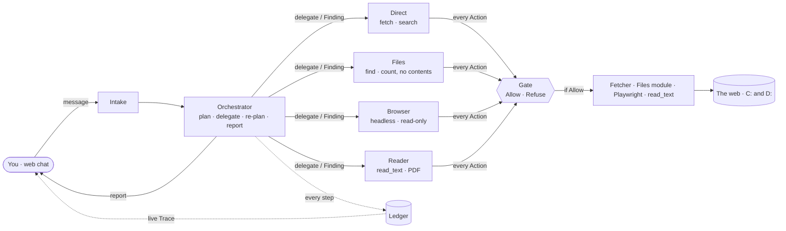

# Game plan — V0-basic: one flow that works end to end

Status: agreed 2026-10-07 · Design: [`architecture.md`](architecture.md) · Decisions: [ADR 0010](adr/0010-one-loop-many-roles.md) · Older slice order: [`roadmap.md`](roadmap.md)

**Progress.** M1–M3 done 2026-10-07; results, decisions and what's next are in [`STATUS.md`](STATUS.md). Next: M4.

**Goal.** From the web chat, ask for something in plain English. An **Orchestrator** plans it, hands each step to a specialist agent (web, files, browser, file reader), and reports back — while you watch every call and return live. Read-only. $1 per Run.

**Not yet:** Memory, Evaluation, Telegram, Approvals, uploads, form filling, organizing files, credentials. They wait until this flow runs end to end.

## What "works" means — the demos

| Milestone | You say | Agents | 
|---|---|---|
| M1 | "What's the news in New York today?" | Orchestrator → Direct |
| M2 | "How many files are on my D drive, by type?" | Orchestrator → Files |
| M3 | "Open `<URL>` and tell me `<thing on the page>`" | Orchestrator → Browser |
| M4 | "Summarize the newest PDF in `<folder>`" | Orchestrator → Files → Reader |
| M4 | "Compare my resume in `<folder>` to the job posting at `<URL>`" | Orchestrator → Files → Browser → Reader |

## How it fits together

## The five Roles

| Role | Tools | Hand | Model | Step cap* |
|---|---|---|---|---|
| **Orchestrator** | `plan`, `delegate`, `ask_user`, `answer` | none | Sonnet 5 | 10 |
| **Direct** | fetch, web search (≤ 3 per Run) | Fetcher ✓ | Haiku 4.5 | 4 |
| **Files** | `find`, `list`, `stat`, `count` — metadata only | Files module | Haiku 4.5 | 6 |
| **Browser** | navigate, read page, scroll, follow link | Playwright, headless, via the installed Chrome | Sonnet 5 | 12 |
| **Reader** | `read_text(path)` for paths the Orchestrator names | `read_text` | Haiku 4.5 (Sonnet if needed) | 3 |

\*Starting values; tune after real runs. Intake stays on Haiku 4.5.

## The rules that keep it safe and honest

1. **One agent in charge.** Only the Orchestrator talks to you. It writes the Plan as data, delegates one step at a time, re-plans at most twice.
2. **One Gate** checks every Action of every Role. **Read-only:** typing, submitting, uploading, downloading, moving or deleting is Refused with a message.
3. **One Budget per Run:** $1, shared by every Role, checked before each model call. At most 3 web searches. A **Stop** button cancels between steps.
4. **A Finding is data, never an instruction.** The Reader returns Findings; the Orchestrator never holds raw file text.
5. **Reach:** all of `C:` and `D:` in read mode through a `grants.toml` only you edit. **Block list:** `.ssh`, `.aws`, `.azure`, `.gnupg`, `.kube`, `.env*`, `*.pem`, `*.key`, `*.pfx`, `id_rsa*`, `*.kdbx`, wallet files, `.git-credentials`, `.npmrc`, `.netrc`, browser profiles, Windows credential folders, `C:\Windows`, `C:\Program Files*`, `C:\ProgramData`, the Recycle Bin, and `D:\Stepout AI` itself.
6. **Read limits per Run:** 20 file reads, 10 MB, 40,000 characters per file sent to the model, 60 seconds for any file walk (partial counts are reported as partial). Secrets are screened out of contents.
7. **After a file's contents have been read,** web search, fetch and browsing are limited to sites you named in the request. The Orchestrator plans web steps first and reading last.
8. **Live Trace:** every Plan step, delegate, return, Action, Verdict, cost and browser screenshot streams to the page from the Ledger.

## Milestones

| M | Build | Done when | Old slice |
|---|---|---|---|
| **M1** — skeleton | `run_agent(role, …)` and a Role table · Orchestrator with a Plan · Direct · shared $1 Budget, 3-search cap · cancel flag · Ledger events carry role and parent · Trace over the WebSocket · trace panel, plan checklist and Stop in the chat · keep source links in answers (S1 gap) · budget default $1.00 | "News in NYC": the Plan appears, Direct is called, every step shows live, the answer has links, Stop works, tests pass | S1b |
| **M2** — Files | Files module: real-path resolution first (junctions, symlinks, 8.3 names, `\\?\`), block list, `grants.toml`, `find`/`list`/`stat`/`count` with walk limits · Files agent · Gate rules | Demo "files on D:" works with no contents leaving the PC; path table tests refuse `.ssh`, `.env`, junction escapes | S8 (part) |
| **M3** — Browser | Playwright with the installed Chrome, headless · network policy on every request (public http(s) only, including page-started requests) · accessibility snapshot plus a screenshot per step · read-only actions · Browser agent · "blocked" report on CAPTCHA or login walls | Demo on a real page; `file://` and `localhost` blocked; screenshots appear in the Trace | S2 |
| **M4** — Reader | `read_text` for text and PDF (pypdf) · secret screening · truncation · read limits · Taint · rule 7 in the Gate · Reader agent · Plans that put web steps first | Both M4 demos; a poisoned PDF causes zero outbound requests | S8 (rest) |

Every milestone is tested offline with a scripted model, plus a live check (`tests/test_live.py`); results are summarized in [`STATUS.md`](STATUS.md).

## Risks and how the plan handles them

| Risk | Handling |
|---|---|
| Orchestrator loops or over-spends | $1 shared Budget, step caps, at most 2 re-plans, Stop button |
| Headless browser blocked by sites | Report "blocked" with a screenshot; never evade |
| Whole-drive read + prompt injection | Block list, read limits, contents only through the Reader, rule 7, Findings untrusted |
| Windows path tricks | Resolve the real path before any check; table tests in M2 |
| Slow whole-drive walks | 60-second cap, report partial results |
| Poor planning | The Plan and Trace are visible; add a Verifier or a separate Planner only if real runs show it |
| File text reaches the API when read | Accepted in V0 and visible in the Trace (the Reader step); metadata-only steps never send contents |

## Later: smarter file search (the User's idea)

M2 already works dir by dir: `find` refuses a whole drive, so the Files agent lists the drive, searches the likely folders, and asks for a hint when it can't tell. To grow that:
- **Ask well.** Offer the likely folders and let the User pick or name one. Needs the Question/Answer pause-and-resume from S3: today a hint arrives as a new request with no memory of the old one, so the User has to restate the goal.
- **Rank folders** by how likely they are to hold the thing: names (Resume, Documents, Work), recent changes, and where it was found before (Memory, S5 — "where the resume lives" is a Persona fact).
- **Prune** folders that can't hold it (`node_modules`, `.git`, virtual environments, caches, build output) so a wider search stays fast.
- **Fuzzy name matching** (typos, "cv" vs "resume") on top of the any-of-these terms `find` takes today.
No full-drive scans: counts stay capped at 60 s and report partial.

## After V0-basic

Approvals (S3) so uploads and form filling become possible; then Memory (S5), Evaluation (S6–S7, S10), Telegram (S4), organizing files (S11).
