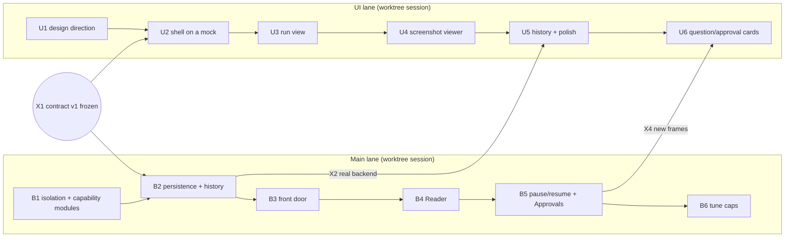

# Plan — two lanes, built in iterations

Status: agreed 2026-10-07 · **finishing V0 from B4 and U3 on: [`v0-finish.md`](v0-finish.md)** · UI contract v1 frozen the same day (sync X1) · replaces the "Remaining, in order" list in [`../STATUS.md`](../STATUS.md) · decisions: [`../log/`](../log/README.md) · design: [`../architecture.md`](../architecture.md)

**Destination.** An assistant you use like an app — separate chats, live progress, a screenshot viewer, a clean look — on a codebase where a new capability is **one file plus one line**, where your message is screened before any money is spent, where a follow-up carries the right history, and where every decision and change is logged and queryable. Built by two agents in two worktrees that rarely touch the same file.

| Lane | Hand-off file | Where it runs | Iterations |
|---|---|---|---|
| **Main** — everything behind the page | [`main-worktree.md`](main-worktree.md) | a Claude Desktop session with the **worktree** option (the app names the branch, e.g. `claude/…`) | B1 isolation + capability modules · B2 persistence · B3 front door · B4 Reader · B5 pause/resume + Approvals · B6 tune |
| **UI** — everything on the page | [`ui-worktree.md`](ui-worktree.md) | a second worktree session, same way | U1 design direction · U2 shell on a mock · U3 run view · U4 screenshot viewer · U5 history + polish · U6 question/approval cards |
| **Merge agent** — the only writer of `main` | below | a plain session in the primary checkout `D:\Stepout AI`, on `main` | one pass per sync point |

## Who owns which file

Collisions are accepted but kept rare: **every path has exactly one owner.** The other lane asks through the contract or a log entry; it does not edit. From B1a, `scripts/owners.py` checks this at every merge.

| Path | Owner |
|---|---|
| `web/**` (page, mock server, fixtures, UI tests), `src/stepout/channels/web.py`, `tests/test_web_channel.py` (it tests only that file) | **UI** |
| everything else under `src/`, `tests/`, `scripts/`, `.githooks/`, `pyproject.toml` | **Main** |
| `docs/ui-contract.md` | shared — change only with a `contract` log entry; both lanes read it at each sync |
| `docs/log/*` | both — one file per entry, unique names, so no conflicts |
| `docs/STATUS.md` | one section per lane (`## Lane: Main`, `## Lane: UI`); each lane edits only its own |
| `docs/plan/main-worktree.md` · `ui-worktree.md` | their lane |
| `src/stepout/CONTEXT.md` (glossary) | Main edits; the UI lane proposes a term in a `term` log entry |

The UI lane never edits the Runner, Gate, Roles or Model. If it needs something from the backend, it writes it into the contract and a log entry, and the Main lane builds it.

## Sync points — where the lanes meet

| Sync | Happens when | What changes |
|---|---|---|
| **X1** | **done 2026-10-07** — the User signed off [`../ui-contract.md`](../ui-contract.md) v1 | unblocks B2 and U2; the contract is frozen until a `contract` entry says otherwise |
| **X2** | B2 is merged to `main` | the page switches from the mock to the real backend; U5 (history) can start; first paid live check |
| **X3** | B3 is merged | declines, chat replies and follow-ups flow through; the page needs no change (verify the events render) |
| **X4** | B5 is merged | question and approval frames exist; U6 starts |

Between syncs a lane takes in fresh work only from `main`, never from the other lane: ask the session to **sync with its base branch** (the app merges `origin/main` into the lane's branch, so `main` must have been pushed), or run `git merge main` yourself.

## Start the lanes in Claude Desktop

Each lane is a Desktop **session with the worktree option**. The app creates the worktree under `.claude/worktrees/` and a branch named `<branch prefix>/<name>` (the prefix is Settings → Claude Code, default `claude`). You do not run `git worktree add` and you do not choose the branch name: each lane agent reports its branch name at the start, and you give both names to the merge agent.

**The base-branch trap (verified in the docs, 2026-10-07).** A new worktree starts from **`origin/main` on the remote**, not from your local commits (the app default; the setting is `worktree.baseRef`, `"fresh"` or `"head"`). So the plan, the contract and the log tool must be **committed and pushed to `main` first**, or a lane starts without them. Every kickoff prompt opens with a check for exactly this.

1. In `D:\Stepout AI` (on `main`): commit and push the plan, then `git config core.hooksPath .githooks` (the log check on every commit, in every worktree).
2. **+ New session** (Ctrl+N) → this project → tick **worktree** → name it `Main lane` → paste the Main kickoff prompt from [`main-worktree.md`](main-worktree.md).
3. Again → name it `UI lane` → paste the UI kickoff prompt from [`ui-worktree.md`](ui-worktree.md).
4. To watch both: hold Ctrl and click the second session in the sidebar (split view).
5. Keep a third, plain session (no worktree) in `D:\Stepout AI` for merging. A fresh one is cleaner than this long planning session.

**Step 0 in both kickoff prompts:** confirm `docs/plan/README.md` exists (if not, stop: wrong base), create the lane's own venv and install, run the baseline, report the branch name.

**Why each worktree needs its own venv (verified 2026-10-07).** The current venv has an editable install pointing at `D:\Stepout AI`. A worktree that reused it would import that checkout's code and test the wrong thing. B1a adds `src` to pytest's path and a test that fails if the wrong tree is imported.

**Secrets.** Do **not** add a `.worktreeinclude`. The lanes need no `.env`: the Main lane runs offline tests only, and the UI lane spends nothing until X2. Paid runs happen in the merge session, in the primary checkout, which already has the key. Never copy or print `.env`.

**Talking between lanes.** Desktop sessions can list each other and send messages ("tell the UI lane the contract changed"). Use it to ask or to announce; the decision still gets a log entry.

**Cleaning up.** Merge first. Archiving a session removes its worktree: commit and merge what you care about before you archive. The branch stays.

Ports: Main's backend is `8765` (override `STEPOUT_PORT`, added in B1a); the UI lane's mock server is `8766`; Vite's dev server is `5173`.

## The merge agent — procedure

A plain session in `D:\Stepout AI`, on `main` (no lane works there, so it is free). Triggered by the User: "sync X2; the lane branches are `<Main branch>` and `<UI branch>`". It builds the merge on a scratch branch, so `main` is untouched until everything is green.

0. `git status` is clean and `git branch --show-current` is `main`. If a lane has uncommitted work, stop and tell the User.
1. `git switch -c integrate`
2. `git merge --no-ff <Main branch>`, then `git merge --no-ff <UI branch>`. Resolve conflicts by the ownership table; for docs keep both sides.
3. Checks — all must pass:
   - `python scripts/log.py check --range main..HEAD` (every code change has a log entry)
   - from B1a: `python scripts/owners.py --lane main <Main branch>` and `--lane ui <UI branch>` (each lane changed only paths it owns)
   - `python -m pytest -q` (offline, includes real Chrome; all tests pass)
   - `cd web && npm ci && npm run lint && npm run build`, plus `npm test` once U2 adds it
   - from X2 on: `python -m pytest tests/test_contract.py`
   - from X2 on, **after telling the User the cost**: `python -X utf8 -m pytest -m eval -s tests/test_live.py` (about $0.11; the only paid step)
   - `docs/STATUS.md` has both lane sections updated
4. Green: `git switch main`, `git merge --ff-only integrate`, `git tag sync-N`, `git branch -d integrate`. **Ask the User before** `git push origin main --tags` (public repo; the lanes sync from the remote). Then tell each lane session to sync.
5. Red: abort an in-progress merge (`git merge --abort`), `git switch main`, delete the scratch branch (`git branch -D integrate`; it was only scratch). Add a `note` log entry with the failure and hand it to the owning lane.

## Rules for every agent in every lane

1. Read first: `CLAUDE.md`, `docs/STATUS.md`, this file, your lane file, `docs/ui-contract.md`, `docs/log/README.md`.
2. Work in **thin vertical slices**, tests green at each step (skill: `incremental-implementation`). Touching files, the web or untrusted input: skill `security-and-hardening`. Changing an interface or a boundary: `api-and-interface-design`.
3. **Log it.** A decision gets an entry when you make it; a behaviour change gets one in the same commit as the code. `python scripts/log.py check --staged` before you commit.
4. **Docs in the same commit**: your lane's `STATUS.md` section, the glossary if a term moved, the code map if a file's job changed. An iteration is not done until these are true.
5. Only offline tests. Paid runs belong to the merge agent, with the User told first.
6. Stay inside your owned paths. Need something outside them? Contract + log entry, then ask.
7. Public repo: no secrets, no personal paths, no real file names from the User's disk in git (fixtures use invented paths).
8. **Commit before you report.** At the end of an iteration, commit on your branch and report its name and what passed. Uncommitted work is lost if the session is archived.

## Definition of done — every iteration

- Its "done when" list in the lane file is true, and you can show each item.
- Offline tests green, and a new test exists for anything that could silently break.
- Log entries written; docs updated; `check` passes.
- The demo works from a clean worktree after the Step 0 setup.

## Risks and how this plan handles them

| Risk | Handling |
|---|---|
| A lane starts without the plan (wrong base) | the plan is pushed to `main` first; Step 0 in each kickoff prompt checks it |
| Both lanes edit the same file | one owner per path; `owners.py` at every merge; the app's isolation checks keep each session inside its own worktree; docs split by section; the log is one file per entry |
| Page and backend drift apart | one contract; Pydantic models validate every UI fixture (`tests/test_contract.py`) |
| A worktree tests the wrong code | own venv per worktree; pytest path guard and an isolation test in B1a |
| UI blocked waiting for the backend | it builds on a mock replaying recorded-style runs until X2 |
| Refactor breaks behaviour (B1) | no behaviour change; the existing tests and the live smoke suite unchanged; a test proves "one file plus one line" |
| Front door declines something legitimate | the 50-prompt set must show **zero** false declines on the demo queries before it is switched on; it fails open |
| Follow-up context leaks across tasks | only linked Exchanges are passed; taint travels with them; history is data, never instructions |
| Paid tests creep into every commit | only the merge agent runs them, once per sync |
| Docs rot | the log check blocks code-without-entry in the hook and at every merge |

## Not yet specified (graduates to tickets when the frontier reaches it)

Approval card shape and exact-file matching (B5) · whether a click is Consequential · how very long chats are summarised · UI details beyond U1–U6 · Jev as an adapter · parallel runs · Telegram and Memory.
